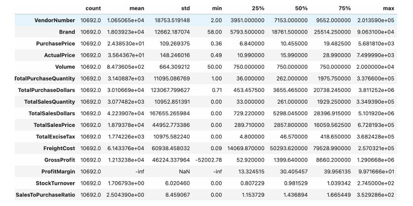
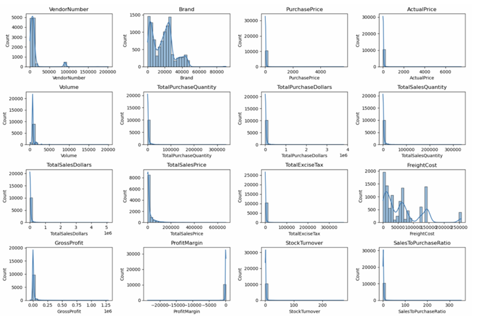
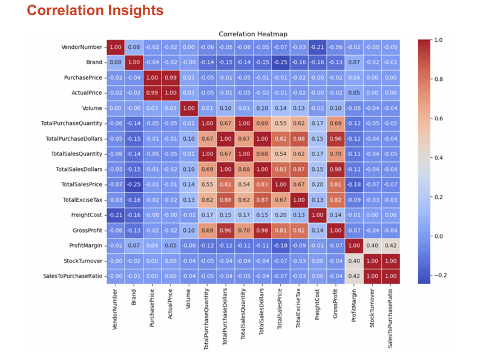
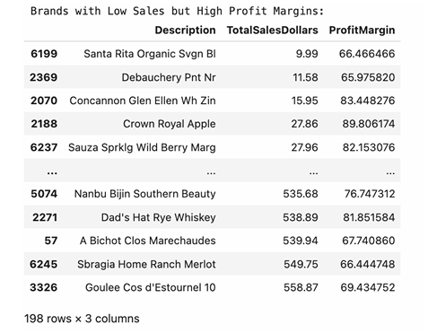
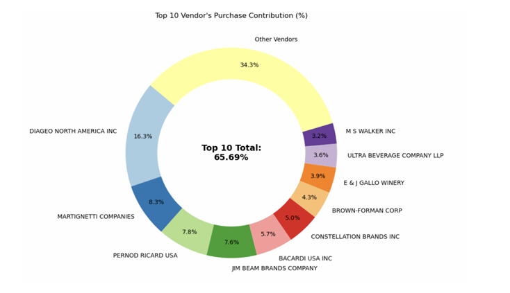
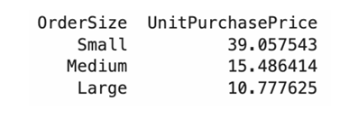
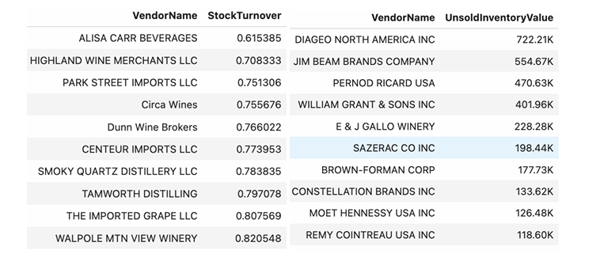
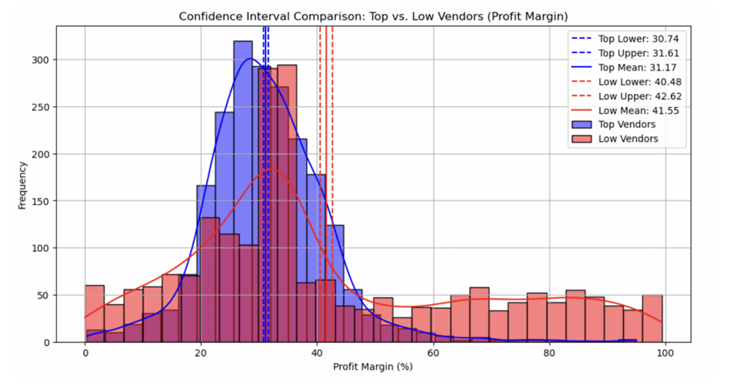

# 📊 Vendor Performance Analysis

## 📌 Project Overview

This project analyzes vendor performance to improve **profitability**, **inventory efficiency**, and **vendor strategy** using data analytics and statistical methods.

---

## 🎯 Business Objectives

* Identify underperforming brands for pricing or promotional adjustments
* Discover top vendors contributing to sales and profit
* Analyze the impact of bulk purchasing on unit cost
* Detect slow-moving inventory and turnover issues
* Compare profit margins across vendor groups

---

## 🧹 Data Cleaning & Preparation

* Removed records with **zero sales quantity**
* Excluded **negative or zero gross profit** transactions
* Filtered **non-profitable margins** to ensure reliable insights

---

## 📊 Exploratory Data Analysis (EDA)

### 🔹 Summary Statistics

Provides an overview of sales, pricing, profit margins, freight cost, and stock turnover to identify inconsistencies and extreme values.

  

  

---

### 🔹 Correlation Analysis

Shows relationships between purchase price, sales, profit margin, and inventory turnover.

  

---

## 🔍 Key Analysis & Findings

### 🟠 Brands Needing Pricing or Promotion

Identifies brands with **low sales but high margins**, indicating opportunities to increase volume without sacrificing profit.

---

### 🟢 Top Vendors Contribution

A small group of vendors contributes the majority of total purchases, creating **vendor dependency risk**.

---

### 🔵 Bulk Purchasing Impact

Bulk buying leads to **significantly lower unit costs**, supporting cost-efficient procurement strategies.

---

### 🔴 Inventory Turnover Analysis

Identifies **slow-moving inventory** that locks capital and increases holding costs.

---

### 🟣 Profit Margin Comparison

Compares profit margins of **high-performing vs low-performing vendors**, showing different profitability models.

---

## 📈 Statistical Validation

Hypothesis testing confirms a **significant difference** in profit margins between top and low-performing vendors.

---

## ✅ Recommendations

* Adjust pricing for low-sales, high-margin brands
* Reduce dependency by diversifying vendors
* Use bulk purchasing strategically to control costs
* Optimize or clear slow-moving inventory
* Improve marketing and distribution for low-performing vendors

---

## 🏁 Conclusion

This analysis provides **actionable insights** to improve profitability, reduce risk, and enhance vendor and inventory management.

---

## 🛠️ Tools & Technologies

* Python (Pandas, NumPy, Matplotlib, Seaborn)
* Statistical Analysis
* Data Visualization

---

## 📂 How to Use

1. Clone the repository
2. Add images to the `images/` folder
3. Update image names in the README if needed
4. Review insights and recommendations
